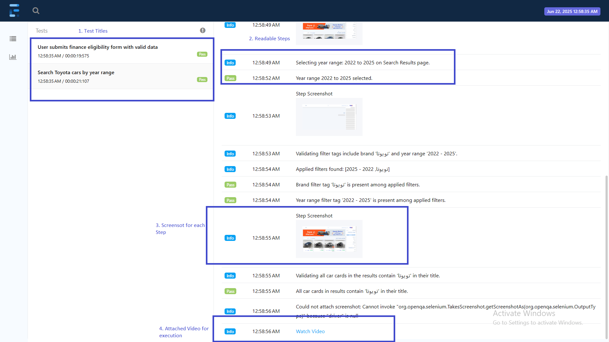
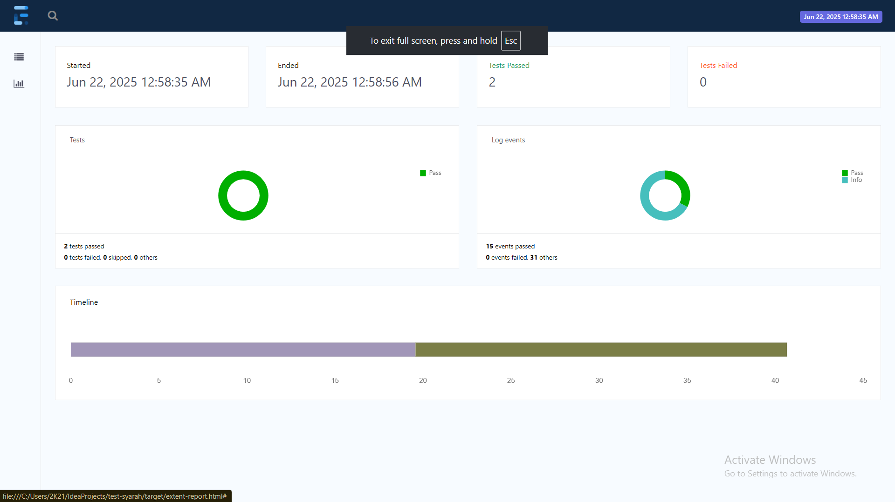
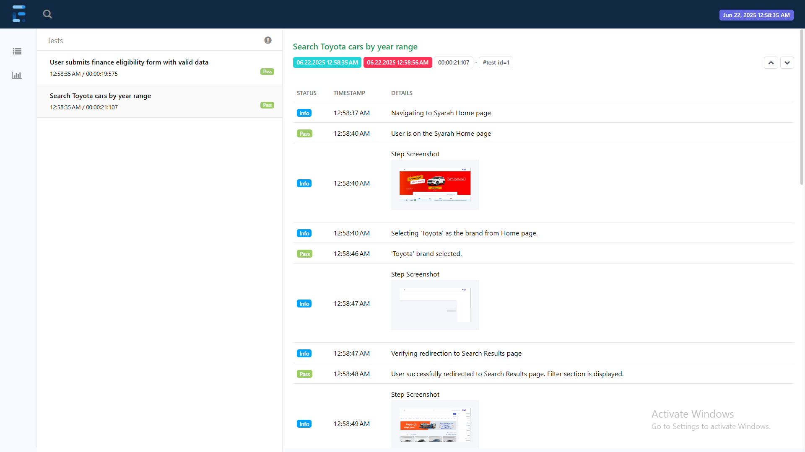
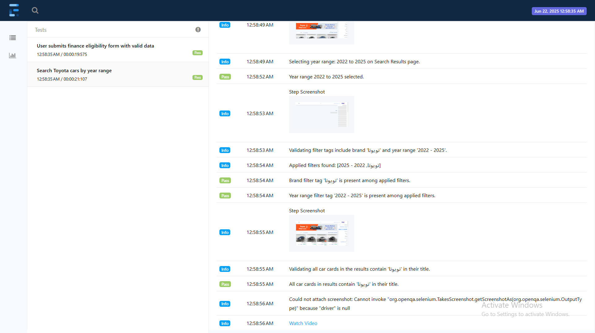
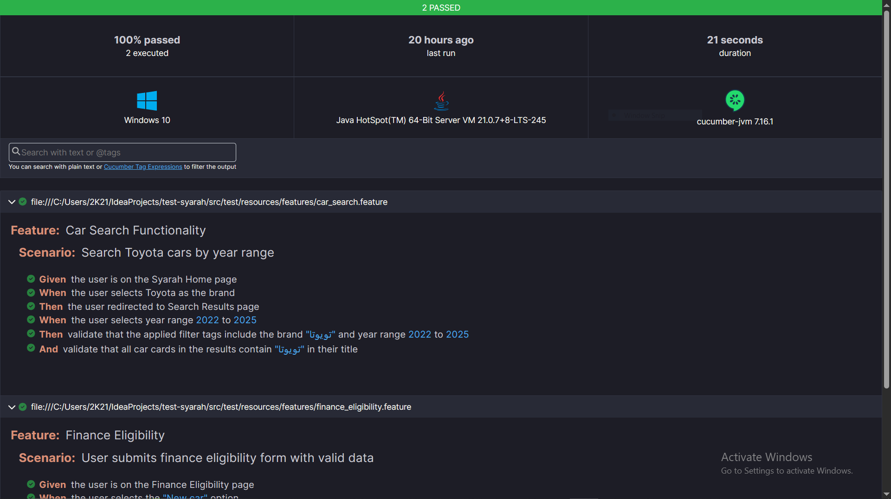

# Syarah – Test Automation Assignment

## 📚 Assignment Overview

## 🚀 Project Features

- **Java + Maven**: Standard project structure for easy dependency management.
- **Selenium WebDriver**: Automates browser actions for end-to-end testing.
- **TestNG**: Used for structuring and executing tests, including parallel execution.
- **Cucumber**: Behavior-driven test scenarios (can be easily extended).
- **Page Object Model (POM)**: Ensures maintainable and modular test code.
- **Extent Reports**: Automated HTML reports with embedded screenshots and video.
- **Parallel Execution**: Enabled via TestNG for faster feedback.

---

## 🏗️ Project Structure

<details>
<summary>Click to expand project structure</summary>

```
├───src
│   ├───main
│   │   └───java
│   └───test
│       ├───java
│       │   ├───com
│       │   │   └───syarah
│       │   ├───config
│       │   ├───hooks
│       │   ├───pages
│       │   ├───reporting
│       │   └───stepdefinitions
│       └───resources
│           └───features
```
</details>

- **config/** – WebDriver & thread-safe driver factory
- **hooks/** – Test initialization and teardown (Cucumber/TestNG Hooks)
- **pages/** – Page Object Model classes
- **reporting/** – ExtentReports and utility classes for reporting
- **stepdefinitions/** – Step definitions for Cucumber features
- **features/** – Cucumber .feature files

---


## ✨ Assignment Tasks & Solutions

### 1. **Test Cases**

#### 1.1 Car Search Functionality
- [car_search.feature](https://github.com/MohmmadNada/test-syarah/blob/main/src/test/resources/features/car_search.feature)

#### 1.2 Finance Eligibility Form
- [finance_eligibility.feature](https://github.com/MohmmadNada/test-syarah/blob/main/src/test/resources/features/finance_eligibility.feature)

#### 1.3 Reporting
- Integrated **ExtentReports** for HTML test reports
- **Screenshots** and **videos** are attached for each test step

#### 1.4 Parallel Execution
- TestNG is configured for parallel execution using `parallel="methods"` (can be switched to serial by setting `parallel="none"`)

---

## 📝 How to Run

### **Run All Tests (Parallel):**
```sh
mvn test
```

### **View Reports**
After execution Run:
```sh
start target\extent-report.html
```
excuation
#### **Sample Screenshot in Report**
1. Extent Report





2. Cucumber Report
